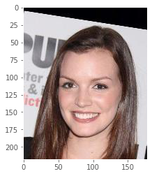
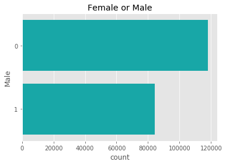
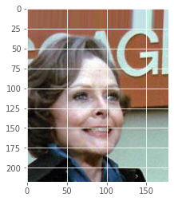
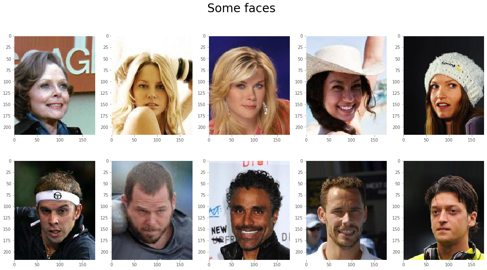
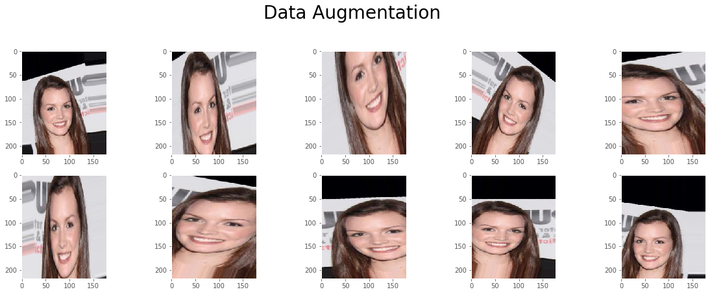
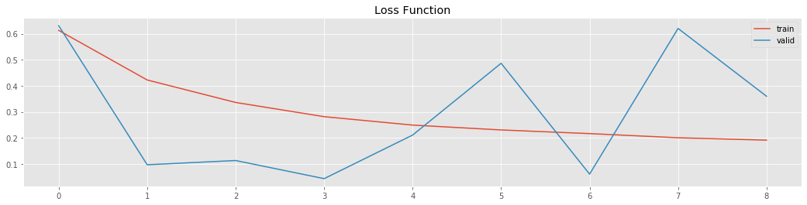
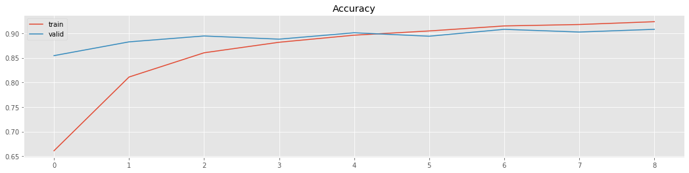

```python
import pandas as pd
import numpy as np
import cv2
import matplotlib.pyplot as plt
import seaborn as sns
from sklearn.metrics import f1_score
from keras.applications.inception_v3 import InceptionV3, preprocess_input
from keras import optimizers
from keras.models import Sequential, Model
from keras.layers import Dropout, Flatten, Dense, GlobalAveragePooling2D
from keras.callbacks import ModelCheckpoint,EarlyStopping
from keras.preprocessing.image import ImageDataGenerator, array_to_img, img_to_array,load_img
from keras.utils import np_utils
from keras.optimizers import SGD
from IPython.core.display import display, HTML
from PIL import Image
from io import BytesIO
import base64
plt.style.use('ggplot')
%matplotlib inline
```

    Using TensorFlow backend.
    


```python
# set variables
# main_folder = './input/celeba-dataset/'
main_folder = 'celeba-dataset/'
images_folder = main_folder + 'img_align_celeba/img_align_celeba/'
EXAMPLE_PIC = images_folder + '000506.jpg'
TRAINING_SAMPLES = 10000
VALIDATION_SAMPLES = 2000
TEST_SAMPLES = 2000
IMG_WIDTH = 178
IMG_HEIGHT = 218
BATCH_SIZE = 32 # 64 128 256 等
# 若有較大的記憶體 可以批量大一些 準確率或許會提高些 可以改善overfitting
NUM_EPOCHS = 10
```


```python
# import the data set that include the attribute for each picture
df_attr = pd.read_csv(main_folder + 'list_attr_celeba.csv')
df_attr.set_index('image_id', inplace=True)
df_attr.replace(to_replace=-1, value=0, inplace=True) #replace -1 by 0
df_attr.shape
```


    (202599, 40)


```python
# List of available attributes
for i, j in enumerate(df_attr.columns):
    print(i, j)
```

    0 5_o_Clock_Shadow
    1 Arched_Eyebrows
    2 Attractive
    3 Bags_Under_Eyes
    4 Bald
    5 Bangs
    6 Big_Lips
    7 Big_Nose
    8 Black_Hair
    9 Blond_Hair
    10 Blurry
    11 Brown_Hair
    12 Bushy_Eyebrows
    13 Chubby
    14 Double_Chin
    15 Eyeglasses
    16 Goatee
    17 Gray_Hair
    18 Heavy_Makeup
    19 High_Cheekbones
    20 Male
    21 Mouth_Slightly_Open
    22 Mustache
    23 Narrow_Eyes
    24 No_Beard
    25 Oval_Face
    26 Pale_Skin
    27 Pointy_Nose
    28 Receding_Hairline
    29 Rosy_Cheeks
    30 Sideburns
    31 Smiling
    32 Straight_Hair
    33 Wavy_Hair
    34 Wearing_Earrings
    35 Wearing_Hat
    36 Wearing_Lipstick
    37 Wearing_Necklace
    38 Wearing_Necktie
    39 Young
    


```python
# plot picture and attributes
img = load_img(EXAMPLE_PIC)
plt.grid(False)
plt.imshow(img)
df_attr.loc[EXAMPLE_PIC.split('/')[-1]][['Smiling','Male','Young']] #some attributes
```


    Smiling    1
    Male       0
    Young      1
    Name: 000506.jpg, dtype: int64





```python
# Female or Male?
plt.title('Female or Male')
sns.countplot(y='Male', data=df_attr, color="c")
plt.show()
```





```python
# Recomended partition
df_partition = pd.read_csv(main_folder + 'list_eval_partition.csv')
df_partition.head()
```


<div>
<style scoped>
    .dataframe tbody tr th:only-of-type {
        vertical-align: middle;
    }

    .dataframe tbody tr th {
        vertical-align: top;
    }

    .dataframe thead th {
        text-align: right;
    }
</style>
<table border="1" class="dataframe">
  <thead>
    <tr style="text-align: right;">
      <th></th>
      <th>image_id</th>
      <th>partition</th>
    </tr>
  </thead>
  <tbody>
    <tr>
      <th>0</th>
      <td>000001.jpg</td>
      <td>0</td>
    </tr>
    <tr>
      <th>1</th>
      <td>000002.jpg</td>
      <td>0</td>
    </tr>
    <tr>
      <th>2</th>
      <td>000003.jpg</td>
      <td>0</td>
    </tr>
    <tr>
      <th>3</th>
      <td>000004.jpg</td>
      <td>0</td>
    </tr>
    <tr>
      <th>4</th>
      <td>000005.jpg</td>
      <td>0</td>
    </tr>
  </tbody>
</table>
</div>


```python
# display counter by partition
# 0 -> TRAINING
# 1 -> VALIDATION
# 2 -> TEST
df_partition['partition'].value_counts().sort_index()
```


    0    162770
    1     19867
    2     19962
    Name: partition, dtype: int64


```python
# join the partition with the attributes
df_partition.set_index('image_id', inplace=True)
df_par_attr = df_partition.join(df_attr['Male'], how='inner')
df_par_attr.head()
```


<div>
<style scoped>
    .dataframe tbody tr th:only-of-type {
        vertical-align: middle;
    }

    .dataframe tbody tr th {
        vertical-align: top;
    }

    .dataframe thead th {
        text-align: right;
    }
</style>
<table border="1" class="dataframe">
  <thead>
    <tr style="text-align: right;">
      <th></th>
      <th>partition</th>
      <th>Male</th>
    </tr>
    <tr>
      <th>image_id</th>
      <th></th>
      <th></th>
    </tr>
  </thead>
  <tbody>
    <tr>
      <th>000001.jpg</th>
      <td>0</td>
      <td>0</td>
    </tr>
    <tr>
      <th>000002.jpg</th>
      <td>0</td>
      <td>0</td>
    </tr>
    <tr>
      <th>000003.jpg</th>
      <td>0</td>
      <td>1</td>
    </tr>
    <tr>
      <th>000004.jpg</th>
      <td>0</td>
      <td>0</td>
    </tr>
    <tr>
      <th>000005.jpg</th>
      <td>0</td>
      <td>0</td>
    </tr>
  </tbody>
</table>
</div>


```python
def load_reshape_img(fname):
    img = load_img(fname)
    x = img_to_array(img)/255.
    x = x.reshape((1,) + x.shape)
    
    return x
```


```python
def generate_df(partition, attr, num_samples):
    '''
    partition
    0 -> train
    1 -> validation
    2 -> test
    '''
    df_ = df_par_attr[(df_par_attr['partition'] == partition)& (df_par_attr[attr] == 0)].sample(int(num_samples/2))
    df_ = pd.concat([df_,df_par_attr[(df_par_attr['partition'] == partition)& (df_par_attr[attr] == 1)].sample(int(num_samples/2))])
    # read data
    x_ = np.array([load_reshape_img(images_folder + fname) for fname in df_.index])
    x_ = x_.reshape(x_.shape[0], 218, 178, 3) # (20000, 1, 218, 178, 3) reshape ==>(20000, 218, 178, 3)
    y_ = np_utils.to_categorical(df_[attr],2)
    return x_, y_
```


```python
x_train,y_train = generate_df(0,'Male',20)
```


```python
x_train.shape
```


    (20, 218, 178, 3)


```python
y_train
```


    array([[1., 0.],
           [1., 0.],
           [1., 0.],
           [1., 0.],
           [1., 0.],
           [1., 0.],
           [1., 0.],
           [1., 0.],
           [1., 0.],
           [1., 0.],
           [0., 1.],
           [0., 1.],
           [0., 1.],
           [0., 1.],
           [0., 1.],
           [0., 1.],
           [0., 1.],
           [0., 1.],
           [0., 1.],
           [0., 1.]], dtype=float32)


```python
num_samples = 10
partition = 0 # train
attr = 'Male'
```


```python
# 抽樣
df_0 = df_par_attr[(df_par_attr['partition'] == partition)
                        & (df_par_attr[attr] == 0)].sample(int(num_samples/2))
```


```python
df_0.shape
```


    (5, 2)


```python
df_0
```


<div>
<style scoped>
    .dataframe tbody tr th:only-of-type {
        vertical-align: middle;
    }

    .dataframe tbody tr th {
        vertical-align: top;
    }

    .dataframe thead th {
        text-align: right;
    }
</style>
<table border="1" class="dataframe">
  <thead>
    <tr style="text-align: right;">
      <th></th>
      <th>partition</th>
      <th>Male</th>
    </tr>
    <tr>
      <th>image_id</th>
      <th></th>
      <th></th>
    </tr>
  </thead>
  <tbody>
    <tr>
      <th>010604.jpg</th>
      <td>0</td>
      <td>0</td>
    </tr>
    <tr>
      <th>112500.jpg</th>
      <td>0</td>
      <td>0</td>
    </tr>
    <tr>
      <th>055585.jpg</th>
      <td>0</td>
      <td>0</td>
    </tr>
    <tr>
      <th>041183.jpg</th>
      <td>0</td>
      <td>0</td>
    </tr>
    <tr>
      <th>098548.jpg</th>
      <td>0</td>
      <td>0</td>
    </tr>
  </tbody>
</table>
</div>


```python
df_1 = df_par_attr[(df_par_attr['partition'] == partition)
& (df_par_attr[attr] == 1)].sample(int(num_samples/2))
```


```python
df_1
```


<div>
<style scoped>
    .dataframe tbody tr th:only-of-type {
        vertical-align: middle;
    }

    .dataframe tbody tr th {
        vertical-align: top;
    }

    .dataframe thead th {
        text-align: right;
    }
</style>
<table border="1" class="dataframe">
  <thead>
    <tr style="text-align: right;">
      <th></th>
      <th>partition</th>
      <th>Male</th>
    </tr>
    <tr>
      <th>image_id</th>
      <th></th>
      <th></th>
    </tr>
  </thead>
  <tbody>
    <tr>
      <th>038321.jpg</th>
      <td>0</td>
      <td>1</td>
    </tr>
    <tr>
      <th>036709.jpg</th>
      <td>0</td>
      <td>1</td>
    </tr>
    <tr>
      <th>116789.jpg</th>
      <td>0</td>
      <td>1</td>
    </tr>
    <tr>
      <th>148235.jpg</th>
      <td>0</td>
      <td>1</td>
    </tr>
    <tr>
      <th>009288.jpg</th>
      <td>0</td>
      <td>1</td>
    </tr>
  </tbody>
</table>
</div>


```python
df_ = pd.concat([df_0, df_1])
```


```python
df_
```


<div>
<style scoped>
    .dataframe tbody tr th:only-of-type {
        vertical-align: middle;
    }

    .dataframe tbody tr th {
        vertical-align: top;
    }

    .dataframe thead th {
        text-align: right;
    }
</style>
<table border="1" class="dataframe">
  <thead>
    <tr style="text-align: right;">
      <th></th>
      <th>partition</th>
      <th>Male</th>
    </tr>
    <tr>
      <th>image_id</th>
      <th></th>
      <th></th>
    </tr>
  </thead>
  <tbody>
    <tr>
      <th>010604.jpg</th>
      <td>0</td>
      <td>0</td>
    </tr>
    <tr>
      <th>112500.jpg</th>
      <td>0</td>
      <td>0</td>
    </tr>
    <tr>
      <th>055585.jpg</th>
      <td>0</td>
      <td>0</td>
    </tr>
    <tr>
      <th>041183.jpg</th>
      <td>0</td>
      <td>0</td>
    </tr>
    <tr>
      <th>098548.jpg</th>
      <td>0</td>
      <td>0</td>
    </tr>
    <tr>
      <th>038321.jpg</th>
      <td>0</td>
      <td>1</td>
    </tr>
    <tr>
      <th>036709.jpg</th>
      <td>0</td>
      <td>1</td>
    </tr>
    <tr>
      <th>116789.jpg</th>
      <td>0</td>
      <td>1</td>
    </tr>
    <tr>
      <th>148235.jpg</th>
      <td>0</td>
      <td>1</td>
    </tr>
    <tr>
      <th>009288.jpg</th>
      <td>0</td>
      <td>1</td>
    </tr>
  </tbody>
</table>
</div>


```python
df_ = df_par_attr[(df_par_attr['partition'] == partition)
& (df_par_attr[attr] == 0)].sample(int(num_samples/2))
```


```python
df_ = pd.concat([df_,
df_par_attr[(df_par_attr['partition'] == partition)
& (df_par_attr[attr] == 1)].sample(int(num_samples/2))])
```


```python
df_
```


<div>
<style scoped>
    .dataframe tbody tr th:only-of-type {
        vertical-align: middle;
    }

    .dataframe tbody tr th {
        vertical-align: top;
    }

    .dataframe thead th {
        text-align: right;
    }
</style>
<table border="1" class="dataframe">
  <thead>
    <tr style="text-align: right;">
      <th></th>
      <th>partition</th>
      <th>Male</th>
    </tr>
    <tr>
      <th>image_id</th>
      <th></th>
      <th></th>
    </tr>
  </thead>
  <tbody>
    <tr>
      <th>150273.jpg</th>
      <td>0</td>
      <td>0</td>
    </tr>
    <tr>
      <th>126312.jpg</th>
      <td>0</td>
      <td>0</td>
    </tr>
    <tr>
      <th>139022.jpg</th>
      <td>0</td>
      <td>0</td>
    </tr>
    <tr>
      <th>037567.jpg</th>
      <td>0</td>
      <td>0</td>
    </tr>
    <tr>
      <th>073645.jpg</th>
      <td>0</td>
      <td>0</td>
    </tr>
    <tr>
      <th>154697.jpg</th>
      <td>0</td>
      <td>1</td>
    </tr>
    <tr>
      <th>074593.jpg</th>
      <td>0</td>
      <td>1</td>
    </tr>
    <tr>
      <th>102375.jpg</th>
      <td>0</td>
      <td>1</td>
    </tr>
    <tr>
      <th>008319.jpg</th>
      <td>0</td>
      <td>1</td>
    </tr>
    <tr>
      <th>145968.jpg</th>
      <td>0</td>
      <td>1</td>
    </tr>
  </tbody>
</table>
</div>


```python
df_.index
```


    Index(['150273.jpg', '126312.jpg', '139022.jpg', '037567.jpg', '073645.jpg',
           '154697.jpg', '074593.jpg', '102375.jpg', '008319.jpg', '145968.jpg'],
          dtype='object', name='image_id')


```python
x_ = np.array([load_reshape_img(images_folder + fname) for fname in df_.index])
```


```python
x_
```


    array([[[[[0.6156863 , 0.3882353 , 0.34509805],
              [0.61960787, 0.39215687, 0.34509805],
              [0.62352943, 0.39607844, 0.34117648],
              ...,
              [0.80784315, 0.8509804 , 0.8745098 ],
              [0.7607843 , 0.88235295, 0.89411765],
              [0.7607843 , 0.88235295, 0.89411765]],
    
             [[0.6156863 , 0.3882353 , 0.34509805],
              [0.61960787, 0.39215687, 0.34509805],
              [0.62352943, 0.39607844, 0.34117648],
              ...,
              [0.80784315, 0.8509804 , 0.8745098 ],
              [0.7607843 , 0.88235295, 0.89411765],
              [0.7607843 , 0.88235295, 0.89411765]],
    
             [[0.6156863 , 0.3882353 , 0.34509805],
              [0.61960787, 0.39215687, 0.34509805],
              [0.62352943, 0.39607844, 0.34117648],
              ...,
              [0.8       , 0.8509804 , 0.8745098 ],
              [0.7529412 , 0.8862745 , 0.89411765],
              [0.7529412 , 0.8862745 , 0.89411765]],
    
             ...,
    
             [[0.12941177, 0.15294118, 0.14509805],
              [0.11372549, 0.13725491, 0.12941177],
              [0.10196079, 0.1254902 , 0.11764706],
              ...,
              [0.6666667 , 0.80784315, 0.7607843 ],
              [0.6745098 , 0.8156863 , 0.76862746],
              [0.6745098 , 0.8156863 , 0.76862746]],
    
             [[0.1254902 , 0.16078432, 0.14901961],
              [0.1254902 , 0.16078432, 0.14901961],
              [0.13333334, 0.16862746, 0.15686275],
              ...,
              [0.7058824 , 0.84705883, 0.8       ],
              [0.6901961 , 0.83137256, 0.78431374],
              [0.6901961 , 0.83137256, 0.78431374]],
    
             [[0.1254902 , 0.16078432, 0.14901961],
              [0.1254902 , 0.16078432, 0.14901961],
              [0.13333334, 0.16862746, 0.15686275],
              ...,
              [0.7058824 , 0.84705883, 0.8       ],
              [0.6901961 , 0.83137256, 0.78431374],
              [0.6901961 , 0.83137256, 0.78431374]]]],
    
    
    
           [[[[0.99215686, 0.99215686, 0.9843137 ],
              [0.99607843, 0.99607843, 0.9882353 ],
              [1.        , 1.        , 0.99215686],
              ...,
              [1.        , 1.        , 1.        ],
              [0.99607843, 0.99607843, 0.99607843],
              [0.99607843, 0.99607843, 0.99607843]],
    
             [[0.99215686, 0.99215686, 0.9843137 ],
              [0.99607843, 0.99607843, 0.9882353 ],
              [1.        , 1.        , 0.99215686],
              ...,
              [1.        , 1.        , 1.        ],
              [0.99607843, 0.99607843, 0.99607843],
              [0.99607843, 0.99607843, 0.99607843]],
    
             [[0.99215686, 0.99215686, 0.9843137 ],
              [0.99607843, 0.99607843, 0.9882353 ],
              [1.        , 1.        , 0.99215686],
              ...,
              [1.        , 1.        , 1.        ],
              [0.99607843, 0.99607843, 0.99607843],
              [0.99607843, 0.99607843, 0.99607843]],
    
             ...,
    
             [[1.        , 0.98039216, 0.8901961 ],
              [0.98039216, 0.9490196 , 0.8666667 ],
              [0.9490196 , 0.9254902 , 0.8392157 ],
              ...,
              [0.9647059 , 0.9647059 , 0.9254902 ],
              [0.98039216, 0.9843137 , 0.9529412 ],
              [0.98039216, 0.9843137 , 0.9529412 ]],
    
             [[1.        , 0.9647059 , 0.8784314 ],
              [0.9529412 , 0.92156863, 0.8392157 ],
              [0.92156863, 0.8901961 , 0.80784315],
              ...,
              [0.99607843, 0.99607843, 0.9647059 ],
              [0.98039216, 0.9843137 , 0.9529412 ],
              [0.98039216, 0.9843137 , 0.9529412 ]],
    
             [[1.        , 0.9647059 , 0.8784314 ],
              [0.9607843 , 0.91764706, 0.8392157 ],
              [0.92156863, 0.8901961 , 0.80784315],
              ...,
              [0.99215686, 0.99607843, 0.9647059 ],
              [0.98039216, 0.9843137 , 0.9529412 ],
              [0.98039216, 0.9843137 , 0.9529412 ]]]],
    
    
    
           [[[[0.1254902 , 0.10980392, 0.40784314],
              [0.1254902 , 0.10980392, 0.40784314],
              [0.1254902 , 0.10980392, 0.40784314],
              ...,
              [0.08235294, 0.08235294, 0.2784314 ],
              [0.08235294, 0.08235294, 0.2784314 ],
              [0.08235294, 0.08235294, 0.2784314 ]],
    
             [[0.1254902 , 0.10980392, 0.40784314],
              [0.1254902 , 0.10980392, 0.40784314],
              [0.1254902 , 0.10980392, 0.40784314],
              ...,
              [0.08235294, 0.08235294, 0.2784314 ],
              [0.07843138, 0.07843138, 0.27450982],
              [0.07843138, 0.07843138, 0.27450982]],
    
             [[0.1254902 , 0.10980392, 0.40784314],
              [0.1254902 , 0.10980392, 0.40784314],
              [0.1254902 , 0.10980392, 0.40784314],
              ...,
              [0.08235294, 0.08235294, 0.2784314 ],
              [0.07843138, 0.07843138, 0.27450982],
              [0.07843138, 0.07843138, 0.27450982]],
    
             ...,
    
             [[1.        , 0.7764706 , 0.6901961 ],
              [0.88235295, 0.6156863 , 0.53333336],
              [0.8862745 , 0.6       , 0.5254902 ],
              ...,
              [0.5686275 , 0.20784314, 0.1254902 ],
              [0.57254905, 0.1764706 , 0.13725491],
              [0.5647059 , 0.16862746, 0.12941177]],
    
             [[0.7176471 , 0.45882353, 0.3647059 ],
              [0.8       , 0.53333336, 0.44313726],
              [0.81960785, 0.53333336, 0.45882353],
              ...,
              [0.58431375, 0.21176471, 0.14117648],
              [0.5686275 , 0.16470589, 0.13725491],
              [0.5686275 , 0.16470589, 0.13725491]],
    
             [[0.57254905, 0.3137255 , 0.21176471],
              [0.6745098 , 0.4117647 , 0.30980393],
              [0.7176471 , 0.43529412, 0.34901962],
              ...,
              [0.5882353 , 0.20784314, 0.14117648],
              [0.5803922 , 0.16862746, 0.14509805],
              [0.5803922 , 0.16862746, 0.14509805]]]],
    
    
    
           ...,
    
    
    
           [[[[0.8862745 , 0.9098039 , 0.9647059 ],
              [0.8862745 , 0.9098039 , 0.9647059 ],
              [0.8862745 , 0.9098039 , 0.9647059 ],
              ...,
              [0.9019608 , 0.9254902 , 0.98039216],
              [0.9098039 , 0.9372549 , 0.96862745],
              [0.9098039 , 0.9372549 , 0.96862745]],
    
             [[0.8784314 , 0.9019608 , 0.95686275],
              [0.8784314 , 0.9019608 , 0.95686275],
              [0.8784314 , 0.9019608 , 0.95686275],
              ...,
              [0.9019608 , 0.9254902 , 0.98039216],
              [0.9098039 , 0.9372549 , 0.96862745],
              [0.9098039 , 0.9372549 , 0.96862745]],
    
             [[0.88235295, 0.90588236, 0.9607843 ],
              [0.88235295, 0.90588236, 0.9607843 ],
              [0.8784314 , 0.9019608 , 0.95686275],
              ...,
              [0.9019608 , 0.9254902 , 0.98039216],
              [0.9098039 , 0.9372549 , 0.96862745],
              [0.9098039 , 0.9372549 , 0.96862745]],
    
             ...,
    
             [[0.9254902 , 0.9098039 , 0.8745098 ],
              [0.84705883, 0.7137255 , 0.70980394],
              [0.78431374, 0.49803922, 0.53333336],
              ...,
              [0.06666667, 0.06666667, 0.06666667],
              [0.08627451, 0.08627451, 0.09411765],
              [0.08627451, 0.08627451, 0.09411765]],
    
             [[0.9019608 , 0.8862745 , 0.8392157 ],
              [0.88235295, 0.7529412 , 0.73333335],
              [0.74509805, 0.4627451 , 0.47843137],
              ...,
              [0.0627451 , 0.0627451 , 0.0627451 ],
              [0.08235294, 0.08235294, 0.09019608],
              [0.08627451, 0.08627451, 0.09411765]],
    
             [[0.9019608 , 0.8901961 , 0.83137256],
              [0.88235295, 0.7529412 , 0.7254902 ],
              [0.7411765 , 0.46666667, 0.4745098 ],
              ...,
              [0.0627451 , 0.0627451 , 0.0627451 ],
              [0.08235294, 0.08235294, 0.09019608],
              [0.08627451, 0.08627451, 0.09411765]]]],
    
    
    
           [[[[0.15294118, 0.16078432, 0.15686275],
              [0.15686275, 0.16470589, 0.16078432],
              [0.16470589, 0.17254902, 0.16862746],
              ...,
              [0.        , 0.        , 0.        ],
              [0.        , 0.        , 0.        ],
              [0.        , 0.        , 0.        ]],
    
             [[0.15294118, 0.16078432, 0.15686275],
              [0.15686275, 0.16470589, 0.16078432],
              [0.16470589, 0.17254902, 0.16862746],
              ...,
              [0.        , 0.        , 0.        ],
              [0.        , 0.        , 0.        ],
              [0.        , 0.        , 0.        ]],
    
             [[0.15294118, 0.16078432, 0.15686275],
              [0.15686275, 0.16470589, 0.16078432],
              [0.16470589, 0.17254902, 0.16862746],
              ...,
              [0.        , 0.        , 0.        ],
              [0.        , 0.        , 0.        ],
              [0.        , 0.        , 0.        ]],
    
             ...,
    
             [[0.9882353 , 0.9882353 , 0.9882353 ],
              [0.9843137 , 0.9843137 , 0.9843137 ],
              [0.9843137 , 0.9843137 , 0.9843137 ],
              ...,
              [0.03921569, 0.03137255, 0.04313726],
              [0.04705882, 0.04313726, 0.0627451 ],
              [0.04705882, 0.04313726, 0.0627451 ]],
    
             [[0.9843137 , 0.9843137 , 0.9843137 ],
              [0.9882353 , 0.9882353 , 0.9882353 ],
              [0.99215686, 0.99215686, 0.99215686],
              ...,
              [0.05882353, 0.05882353, 0.06666667],
              [0.04705882, 0.04313726, 0.0627451 ],
              [0.04705882, 0.04313726, 0.0627451 ]],
    
             [[0.9843137 , 0.9843137 , 0.9843137 ],
              [0.9882353 , 0.9882353 , 0.9882353 ],
              [0.99215686, 0.99215686, 0.99215686],
              ...,
              [0.03529412, 0.03529412, 0.04313726],
              [0.04705882, 0.04313726, 0.06666667],
              [0.04705882, 0.04313726, 0.06666667]]]],
    
    
    
           [[[[0.12156863, 0.12941177, 0.11764706],
              [0.12156863, 0.12941177, 0.11764706],
              [0.12156863, 0.12941177, 0.11764706],
              ...,
              [0.09411765, 0.10196079, 0.09803922],
              [0.09411765, 0.10196079, 0.09803922],
              [0.09411765, 0.10196079, 0.09803922]],
    
             [[0.12156863, 0.12941177, 0.11764706],
              [0.12156863, 0.12941177, 0.11764706],
              [0.12156863, 0.12941177, 0.11764706],
              ...,
              [0.09411765, 0.10196079, 0.09803922],
              [0.09411765, 0.10196079, 0.09803922],
              [0.09411765, 0.10196079, 0.09803922]],
    
             [[0.12156863, 0.12941177, 0.11764706],
              [0.12156863, 0.12941177, 0.11764706],
              [0.12156863, 0.12941177, 0.11764706],
              ...,
              [0.09411765, 0.10196079, 0.09803922],
              [0.09411765, 0.10196079, 0.09803922],
              [0.09411765, 0.10196079, 0.09803922]],
    
             ...,
    
             [[0.17254902, 0.1764706 , 0.19215687],
              [0.17254902, 0.1764706 , 0.19215687],
              [0.16862746, 0.17254902, 0.19215687],
              ...,
              [0.972549  , 0.99215686, 0.41960785],
              [0.9843137 , 0.9764706 , 0.34901962],
              [0.9843137 , 0.9764706 , 0.34901962]],
    
             [[0.1882353 , 0.20392157, 0.21568628],
              [0.1882353 , 0.20392157, 0.21568628],
              [0.19215687, 0.19607843, 0.21568628],
              ...,
              [0.972549  , 0.9882353 , 0.4117647 ],
              [0.9882353 , 0.9764706 , 0.32941177],
              [0.9882353 , 0.9764706 , 0.32941177]],
    
             [[0.1882353 , 0.20392157, 0.21568628],
              [0.1882353 , 0.20392157, 0.21568628],
              [0.18431373, 0.2       , 0.21176471],
              ...,
              [0.9764706 , 0.9882353 , 0.3882353 ],
              [0.9882353 , 0.98039216, 0.3137255 ],
              [0.9882353 , 0.98039216, 0.3137255 ]]]]], dtype=float32)


```python
x_.shape
```


    (10, 1, 218, 178, 3)


```python
x_ = x_.reshape(x_.shape[0], 218, 178, 3)
```


```python
x_.shape
```


    (10, 218, 178, 3)


```python
y_ = np_utils.to_categorical(df_[attr],2)
```


```python
y_
```


    array([[1., 0.],
           [1., 0.],
           [1., 0.],
           [1., 0.],
           [1., 0.],
           [0., 1.],
           [0., 1.],
           [0., 1.],
           [0., 1.],
           [0., 1.]], dtype=float32)


```python

```


```python
images_folder + df_.index[0]
```


    'celeba-dataset/img_align_celeba/img_align_celeba/150273.jpg'


```python
fname = images_folder + df_.index[0]
```


```python
img = load_img(fname)
```


```python
img
```


```python
plt.imshow(img)
```


    <matplotlib.image.AxesImage at 0x1db40674080>





```python
# plot some iamges
plt.figure(figsize=(20,10))
plt.suptitle('Some faces', fontsize=28)
for i, fname in enumerate(df_.index):
    
    
    plt.subplot(2, 5, i+1)
    plt.grid(False)
    
    img = load_img(images_folder + fname)
    x = img_to_array(img)/255.
    
    plt.imshow( x )
plt.show()
```





```python
# Generate image generator for data augmentation
# Don't preprocess_input data here, because we want to draw those images.
datagen = ImageDataGenerator(
  # preprocessing_function=preprocess_input,
  rotation_range=30,
  width_shift_range=0.2,
  height_shift_range=0.2,
  shear_range=0.2,
  zoom_range=0.5,
  horizontal_flip=True
)
```


```python
# load one image and reshape
img = load_img(EXAMPLE_PIC)
x = img_to_array(img)/255. # 繪圖0~1 float32 0~255 需為int
x = x.reshape((1,) + x.shape)

# plot 10 augmented images of the loaded iamge
plt.figure(figsize=(20,10))
plt.suptitle('Data Augmentation', fontsize=28)

i = 0
for batch in datagen.flow(x, batch_size=1):
    plt.subplot(3, 5, i+1)
    plt.grid(False)
    plt.imshow( batch.reshape(218, 178, 3))
    if i == 9:
        break
    i += 1
plt.show()
```





```python
%%time
# Train data: it takes a while to load data
x_train, y_train = generate_df(0, 'Male', TRAINING_SAMPLES)
# Train - Data Preparation - Data Augmentation with generators
train_datagen = ImageDataGenerator(
  preprocessing_function=preprocess_input,
  rotation_range=30,
  width_shift_range=0.2,
  height_shift_range=0.2,
  shear_range=0.2,
  zoom_range=0.2,
  horizontal_flip=True,
)

train_datagen.fit(x_train)

train_generator = train_datagen.flow(
x_train, y_train,
batch_size=BATCH_SIZE,
)
```

    Wall time: 38.7 s
    


```python

```


```python
# how many steps for each epoch
# 一個訓練回合，會載入多少次?(每一次載入一個batch=32)
TRAINING_SAMPLES/BATCH_SIZE
```


    312.5


```python
len(train_generator)
```


    313


```python

```


```python
# Validation Data
x_valid, y_valid = generate_df(1, 'Male', VALIDATION_SAMPLES)

# 在後面的範例中並沒有(通常也不需要)對validataion做影像增強
# Validation - Data Preparation - Data Augmentation with generators
# validation set 需要批次讀入 ? 若數據量大時 需要 否則一次讀入即可
valid_datagen = ImageDataGenerator(
# preprocessing_function=preprocess_input,
)

valid_datagen.fit(x_valid)

validation_generator = valid_datagen.flow(
x_valid, y_valid,
)
```


```python

```


```python
validation_generator
```


    <keras.preprocessing.image.NumpyArrayIterator at 0x1db41ca80f0>


```python

```


```python

```


```python
# Import InceptionV3 Model
inc_model = InceptionV3(weights='./inception_v3_weights_tf_dim_ordering_tf_kernels_notop.h5',
                        include_top=False,
                        input_shape=(IMG_HEIGHT, IMG_WIDTH, 3))
print("number of layers:", len(inc_model.layers))
#inc_model.summary()
```

    number of layers: 311
    


```python
#Adding custom Layers
m = inc_model.output
m = GlobalAveragePooling2D()(m)
m = Dense(1024, activation="relu")(m)
m = Dropout(0.5)(m)
m = Dense(512, activation="relu")(m)
predictions = Dense(2, activation="softmax")(m)
```


```python
# creating the final model (a new one)
model = Model(inputs=inc_model.input, outputs=predictions)
```


```python
#model summary
```


```python

```


```python
# Lock initial layers to do not be trained
for layer in model.layers[:52]:
    layer.trainable = False
```


```python

```


```python
# compile the model
# 分類交叉熵categorical_crossentropy:2個或2個以上類別用one-hot格式
# 二進制交叉熵binary_crossentropy: 輸出層以一個node表達2個類別0,1
model.compile(optimizer=SGD(lr=0.0001, momentum=0.9), 
              loss='categorical_crossentropy', 
              metrics=['acc'])
```


```python
#https://keras.io/models/sequential/ fit generator
# 如果我們只想保存一個最好的模型，那麼把保存文件名字固定為filepath="model.best.hdf5
# 如果要存權重 save_weights_only=True ==> filepath="weights.best.hdf5"
#
model_saved_path = 'model.best.inc.celeb_gender.hdf5'
checkpoint = ModelCheckpoint(filepath=model_saved_path,
                            monitor='val_loss', # 越小越好 monitor='val_acc' 越大越好
                            save_best_only=True,
                            mode='auto', # mode='max', mode='min'
                            verbose=1, period=1)
```


```python
# 搭配EarlyStopping
earlystop = EarlyStopping(monitor='val_loss', patience=5, verbose=1)
# EarlyStoppingByLossVal(monitor='val_loss', value=0.00001, verbose=1),
# patience=5 表示連續5次沒有改善就停止訓練
```


```python

```


```python
%%time
# Fit the model
hist = model.fit_generator(train_generator # 一次讀入一批訓練
    , validation_data = validation_generator # validate: 一次讀入一批驗證
    , steps_per_epoch= TRAINING_SAMPLES/BATCH_SIZE
    , epochs= 10
    , callbacks=[checkpoint, earlystop] ## 或是: [checkpoint]
    , verbose=1
)
```

    Epoch 1/10
    313/312 [==============================] - 98s 314ms/step - loss: 0.6130 - acc: 0.6611 - val_loss: 0.6309 - val_acc: 0.8545
    
    Epoch 00001: val_loss improved from inf to 0.63087, saving model to model.best.inc.celeb_gender.hdf5
    Epoch 2/10
    313/312 [==============================] - 79s 251ms/step - loss: 0.4222 - acc: 0.8110 - val_loss: 0.0964 - val_acc: 0.8825
    
    Epoch 00002: val_loss improved from 0.63087 to 0.09640, saving model to model.best.inc.celeb_gender.hdf5
    Epoch 3/10
    313/312 [==============================] - 79s 252ms/step - loss: 0.3358 - acc: 0.8603 - val_loss: 0.1127 - val_acc: 0.8945
    
    Epoch 00003: val_loss did not improve from 0.09640
    Epoch 4/10
    313/312 [==============================] - 79s 251ms/step - loss: 0.2814 - acc: 0.8817 - val_loss: 0.0430 - val_acc: 0.8880
    
    Epoch 00004: val_loss improved from 0.09640 to 0.04303, saving model to model.best.inc.celeb_gender.hdf5
    Epoch 5/10
    313/312 [==============================] - 79s 251ms/step - loss: 0.2489 - acc: 0.8961 - val_loss: 0.2105 - val_acc: 0.9010
    
    Epoch 00005: val_loss did not improve from 0.04303
    Epoch 6/10
    313/312 [==============================] - 79s 251ms/step - loss: 0.2311 - acc: 0.9047 - val_loss: 0.4864 - val_acc: 0.8940
    
    Epoch 00006: val_loss did not improve from 0.04303
    Epoch 7/10
    313/312 [==============================] - 79s 251ms/step - loss: 0.2162 - acc: 0.9149 - val_loss: 0.0603 - val_acc: 0.9080
    
    Epoch 00007: val_loss did not improve from 0.04303
    Epoch 8/10
    313/312 [==============================] - 79s 251ms/step - loss: 0.2002 - acc: 0.9178 - val_loss: 0.6203 - val_acc: 0.9025
    
    Epoch 00008: val_loss did not improve from 0.04303
    Epoch 9/10
    313/312 [==============================] - 79s 251ms/step - loss: 0.1909 - acc: 0.9235 - val_loss: 0.3597 - val_acc: 0.9080
    
    Epoch 00009: val_loss did not improve from 0.04303
    Epoch 00009: early stopping
    Wall time: 12min 54s
    


```python

```


```python
# Plot loss function value through epochs
plt.figure(figsize=(18, 4))
plt.plot(hist.history['loss'], label = 'train')
plt.plot(hist.history['val_loss'], label = 'valid')
plt.legend()
plt.title('Loss Function')
plt.show()
```





```python
# Plot accuracy through epochs
plt.figure(figsize=(18, 4))
plt.plot(hist.history['acc'], label = 'train')
plt.plot(hist.history['val_acc'], label = 'valid')
plt.legend()
plt.title('Accuracy')
plt.show()
```





```python

```


```python
x_test, y_test = generate_df(2, 'Male', TEST_SAMPLES)
```


```python
x_test.shape
```


    (2000, 218, 178, 3)


```python
x_test[0][0][0]
```


    array([0.7764706 , 0.76862746, 0.77254903], dtype=float32)


```python
model.evaluate(x_test, y_test)
```

    2000/2000 [==============================] - 6s 3ms/step
    


    [0.2724657043926418, 0.8960000276565552]


```python

```


```python
 model.save('model_inceptionv3_celeb_gender.h5')
```


```python

```


```python
def predict_gender(filename):
    im = cv2.imread(filename)
    im = cv2.resize(cv2.cvtColor(im, cv2.COLOR_BGR2RGB), 
                    (IMG_WIDTH,IMG_HEIGHT)).astype(np.float32) / 255.0
    im = np.expand_dims(im, axis =0)
    # prediction
    result = model.predict(im)
    prediction = np.argmax(result)
    return result
```


```python
img_path = 'Jay-Chou.jpg'
```


```python
Image.open(img_path)
```


```python
predict_gender(img_path)
```


    array([[0.11526459, 0.8847354 ]], dtype=float32)


```python

```
